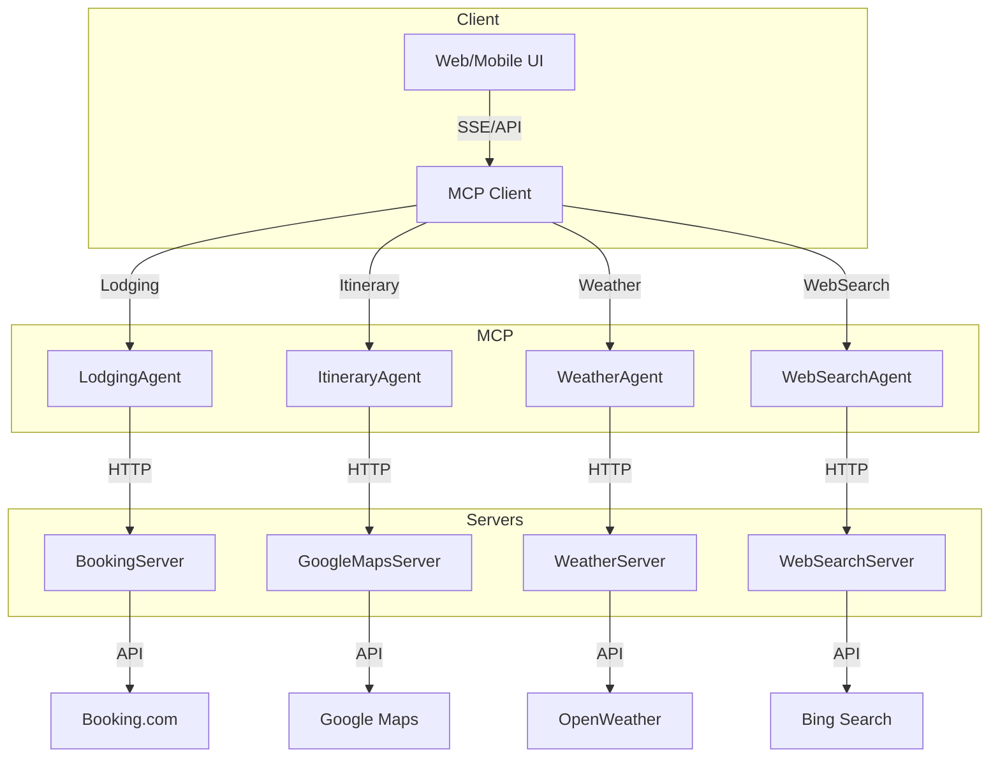

---

## Building a Real-Time, Modular Multi-Agent Travel Planner with .NET 10

I’m excited to share a recent project where I built a real-time, modular, multi-agent travel planning system using the latest .NET 10 features. This solution demonstrates how modern .NET enables scalable, cloud-ready, and maintainable architectures for complex domains like travel planning.

---

### 🏗️ High-Level Architecture

The system is based on the Model Context Protocol (MCP) and is designed for both monolithic and microservices (AWS Lambda) deployments. It features:

- **Agents** for lodging, itinerary, weather, and web search
- **Servers** for each data provider (e.g., Booking.com, Google Maps, OpenWeather)
- **Real-time streaming** using Server-Sent Events (SSE) and IAsyncEnumerable
- **Configuration-driven API access** via appsettings.json
- **Built-in validation** using .NET 10 DataAnnotations

#### Architecture Diagram (Mermaid)



---

### ⚡ Key Features

- **Modular Multi-Agent Design:** Each agent/server is independently testable and replaceable.
- **Real-Time Streaming:** Uses IAsyncEnumerable and SSE for responsive, scalable data delivery.
- **Cloud-Ready:** Deploy as a monolith or as AWS Lambda microservices.
- **Configuration-Driven:** All API endpoints and credentials are managed in appsettings.json.
- **Modern Validation:** Uses .NET 10 DataAnnotations and custom validators for robust, declarative validation.

---

### 🧑‍💻 Example: Real-Time Accommodation Streaming

```csharp
public async IAsyncEnumerable<string> StreamAccommodationsAsync(
    string location, DateTime checkIn, DateTime checkOut, int guests)
{
    var hotelsUrl = _baseUrl.TrimEnd('/') +
        $"/bookings.getHotels?city_ids={Uri.EscapeDataString(location)}&checkin={checkIn:yyyy-MM-dd}&checkout={checkOut:yyyy-MM-dd}&room1=A,{guests}";
    var bookingSecret = Environment.GetEnvironmentVariable("BOOKING_COM_SECRET") ?? "YOUR_BOOKING_COM_SECRET";
    var byteArray = System.Text.Encoding.ASCII.GetBytes($"{_apiKey}:{bookingSecret}");
    var request = new HttpRequestMessage(HttpMethod.Get, hotelsUrl);
    request.Headers.Authorization = new System.Net.Http.Headers.AuthenticationHeaderValue("Basic", Convert.ToBase64String(byteArray));
    var response = await _httpClient.SendAsync(request);
    response.EnsureSuccessStatusCode();
    var json = await response.Content.ReadAsStringAsync();
    using var doc = System.Text.Json.JsonDocument.Parse(json);
    if (doc.RootElement.TryGetProperty("result", out var hotels))
    {
        foreach (var hotel in hotels.EnumerateArray())
        {
            var name = hotel.GetProperty("hotel_name").GetString();
            var address = hotel.GetProperty("address").GetString();
            yield return $"{name} - {address}";
        }
    }
}
```

---

### 🛡️ Example: Modern Validation with DataAnnotations

```csharp
public record PlanTripRequest : IValidatableObject
{
    [Required, MinLength(3)]
    public string? Destination { get; set; }
    [Required, DataType(DataType.Date)]
    public DateTime CheckIn { get; set; }
    [Required, DataType(DataType.Date)]
    public DateTime CheckOut { get; set; }
    [Required, Range(1, 20)]
    public int Guests { get; set; }

    public IEnumerable<ValidationResult> Validate(ValidationContext validationContext)
        => PlanTripRequestValidator.Validate(this);
}
```

**Custom Validator:**

```csharp
public static class PlanTripRequestValidator
{
    public static IEnumerable<ValidationResult> Validate(PlanTripRequest req)
    {
        if (req.CheckIn >= req.CheckOut)
            yield return new ValidationResult(
                "Check-in date must be before check-out date.",
                new[] { nameof(req.CheckIn), nameof(req.CheckOut) });
        if (req.CheckIn < DateTime.Today)
            yield return new ValidationResult(
                "Check-in date cannot be in the past.",
                new[] { nameof(req.CheckIn) });
    }
}
```

---

### 🌐 API Route Example with Error Handling

```csharp
app.MapGet("/plantrip",
    async (IMCPClient mcpClient, [AsParameters] PlanTripRequest req) =>
    {
        try
        {
            var result = await mcpClient.PlanTripAsync(req.Destination!, req.CheckIn, req.CheckOut, req.Guests);
            return Results.Ok(result);
        }
        catch (ArgumentException aex)
        {
            return Results.BadRequest(aex.Message);
        }
        catch (Exception ex)
        {
            return Results.Problem($"Error planning trip: {ex.Message}");
        }
    });
```

---

### ☁️ Cloud-Ready and DevOps Friendly

- **.gitignore** for .NET, VS Code, and OS artifacts
- **appsettings.json** for all environment-specific configuration
- **Ready for CI/CD and AWS Lambda deployment**

---

## 🚀 Conclusion

This project demonstrates how .NET 10 enables rapid, robust, and scalable development for real-world, cloud-native applications. If you’re interested in modern .NET, cloud architectures, or AI-driven travel solutions, let’s connect!

#dotnet #cloud #microservices #traveltech #serverless #validation #SSE #BookingAPI #architecture

---

Let me know if you want a deeper technical dive, more code samples, or a walkthrough of the deployment process!
