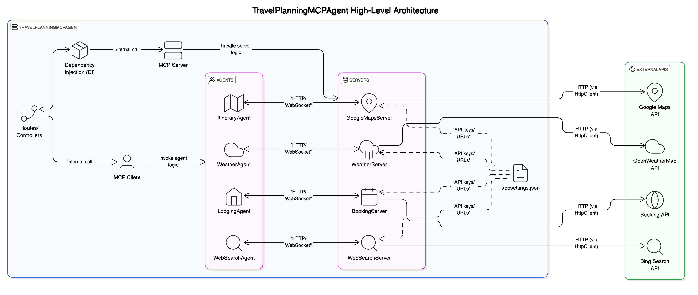
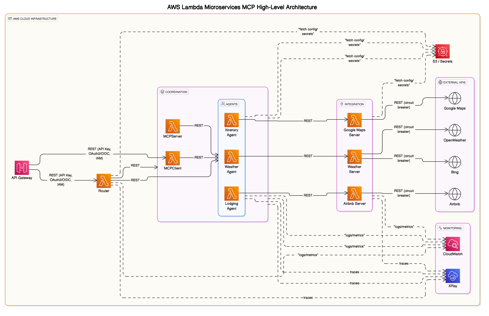

### High-Level Architecture (Monolith with MCP Client/Server)

```
+----------------------------------------------------------------------+
|                        TravelPlanningMCPAgent                        |
|----------------------------------------------------------------------|
| +-------------------+     +-----------------------------+            |
| | Routes/Controllers|<--->| Dependency Injection (DI)   |            |
| +-------------------+     +-----------------------------+            |
|         |                           |                                |
|         v                           v                                |
| +-------------------+     +-----------------------------+            |
| |   MCP Client      |<--->|         MCP Server          |            |
| +-------------------+     +-----------------------------+            |
|         |                           |                                |
|         v                           v                                |
| +-------------------+     +-----------------------------+            |
| |     Agents        |<--->|         Servers             |            |
| |-------------------|     |-----------------------------|            |
| | LodgingAgent      |     | BookingServer               |            |
| | ItineraryAgent    |     | GoogleMapsServer            |            |
| | WeatherAgent      |     | WeatherServer               |            |
| | WebSearchAgent    |     | WebSearchServer             |            |
| +-------------------+     +-----------------------------+            |
|         |                           |                                |
|         v                           v                                |
| +-------------------------------------------------------+            |
| |                External APIs (via HttpClient)         |            |
| |  - Booking API (if available)                         |            |
| |  - Google Maps API                                    |            |
| |  - OpenWeatherMap API                                 |            |
| |  - Bing Search API                                    |            |
| +-------------------------------------------------------+            |
| +-------------------+                                                |
| | appsettings.json  |  (Configuration for API keys/URLs)             |
| +-------------------+                                                |
+----------------------------------------------------------------------+
```


### High-Level Architecture (AWS Lambda Microservices with MCP)

```
+-----------------------------------------------------------------------------------+|
|                                 AWS Cloud Infrastructure                           |
|------------------------------------------------------------------------------------|
|                                                                                    |
|   +-------------------+         +-------------------+         +----------------+   |
|   |   API Gateway     | <-----> |   Lambda: Router  | <-----> |   S3/Secrets   |   |
|   +-------------------+         +-------------------+         +----------------+   |
|            |                          |                                 |          |
|            v                          v                                 |          |
|   +-------------------+   +-------------------+   +-------------------+ |          |
|   | Lambda: MCPClient |   | Lambda: MCPServer |   | Lambda: Agents    | |          |
|   +-------------------+   +-------------------+   +-------------------+ |          |
|            |                          |                 |               |          |
|            v                          v                 v               |          |
|   +-------------------+   +-------------------+   +-------------------+ |          |
|   | Lambda: Lodging   |   | Lambda: Itinerary |   | Lambda: Weather   | |          |
|   |   Agent           |   |   Agent           |   |   Agent           | |          |
|   +-------------------+   +-------------------+   +-------------------+ |          |
|            |                          |                 |               |          |
|            v                          v                 v               |          |
|   +-------------------+   +-------------------+   +-------------------+ |          |
|   | Lambda: Airbnb    |   | Lambda: Google    |   | Lambda: Weather   | |          |
|   |   Server          |   |   Maps Server     |   |   Server          | |          |
|   +-------------------+   +-------------------+   +-------------------+ |          |
|            |                          |                 |               |          |
|            v                          v                 v               |          |
|   +-------------------+   +-------------------+   +-------------------+ |          |
|   |   External APIs   |   |   External APIs   |   |   External APIs   | |          |
|   |   (Airbnb, etc.)  |   |   (Google Maps)   |   |   (OpenWeather)   | |          |
|   +-------------------+   +-------------------+   +-------------------+ |          |
|                                                                                    |
|   +-------------------+                                                            |
|   |  CloudWatch, XRay |  (Monitoring, Logging, Tracing)                            |
|   +-------------------+                                                            |
+------------------------------------------------------------------------------------+
```

- Each MCP server, agent, and client is deployed as a separate AWS Lambda function.
- API Gateway routes requests to the appropriate Lambda (Router or MCPClient).
- Lambdas communicate via HTTP (REST/gRPC) or AWS messaging (SNS/SQS/EventBridge) as needed.
- Secrets (API keys, config) are stored in AWS Secrets Manager or S3.
- Monitoring and tracing via AWS CloudWatch and X-Ray.
- External APIs (Airbnb, Google Maps, OpenWeather, Bing, etc.) are accessed from the respective Lambda functions.



### Travel Planning Multi-Agent System
#### Description: 
Create a team of MCP agents that fetch real-time data from multiple sources (e.g., Airbnb, Google Maps, weather APIs, web search) to plan a trip. Each agent handles a specific task, coordinated via MCP servers.

#### Applications:
    Build a personalized travel assistant for users planning vacations.
    Automate itinerary creation for travel agencies, including lodging, activities, and weather considerations.
    Provide real-time updates (e.g., weather changes) to adjust plans dynamically.

### Implementation Steps:
#### MCP Servers:
Create separate MCP servers for each data source:
    Airbnb Server: Exposes tools to search listings and book accommodations.
    Google Maps Server: Provides tools for location-based searches (e.g., restaurants, attractions).
    Weather Server: Fetches forecasts for trip dates.
    Web Search Server: Uses Brave Search for general queries (e.g., travel tips).
    Use .Net to define tools with clear schemas (e.g., search_airbnb with parameters for location and dates).

#### MCP Clients and Agents:
    Develop a central MCP client (e.g., in Claude Desktop or a custom app) that coordinates multiple agents.
    Each agent specializes in one task (e.g., lodging, itinerary, weather) and sends requests to the relevant MCP server.

#### Agent Workflow:
    User prompt: “Plan a weekend trip to Paris.”

#### Agents collaborate:
    Lodging agent queries Airbnb for hotels.
    Itinerary agent uses Google Maps to find attractions.
    Weather agent checks forecasts and suggests indoor/outdoor activities.
    Web search agent gathers travel tips.
    The central client compiles results into a cohesive itinerary.

#### Security and Scalability:
    Implement rate-limiting to manage API quotas (e.g., Airbnb, Google Maps).
    Use MCP’s standardized authentication to secure API calls.

#### Learning Value:
    Learn to orchestrate multiple MCP servers and agents for complex workflows.
    Practice handling real-time data from diverse sources.
    Understand MCP’s role in reducing integration complexity (M+N instead of M×N).